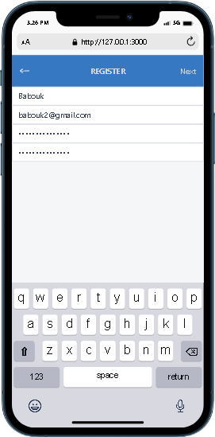
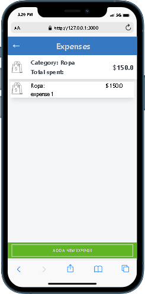
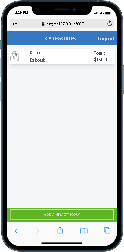

# Budget App

**Budget App** App is an application that helps your expenses and stay on budget!.

|   |   |   |
|---|---|---|
|   |   |   |   

# This project was built with

- Ruby on Rails

- Postgressql

- Tailwind CSS

## Live Demo

[Live Demo link](https://blooming-temple-54098.herokuapp.com/)

## Loom video
[Loom video link](https://www.loom.com/share/2a189b1491a64e82a1b6f24794468c96)

# Getting Started

To get a local copy up and running follow these simple steps.

- You can clone this repo by typing `https://github.com/david-lafontant/Budget-App.git` on your terminal.

- Type `cd Budget-app` to access the project on the terminal.
  
- Run `bundle install` to install all the required dependancies.
- - Run `rails db:reset` to drop, create and migrate a new database.
- Run `rails s` to start a development server.

# Testing

`rspec` will run all the tests.

Also, you can run `rspec [FILE PATH]` to run specific tests.

You can also run `RAILS_ENV=test rspec spec/` to run the tests in test mode.

## Errors

If you encounter any errors, run the following commands.

- Run `rails db:reset` to drop, create and migrate a new database.

- Run `rubocop && rubocop -A` to check for and fix code errors.

## Author

👤 **David Lafontant**

- GitHub: [@david-lafontant](https://github.com/david-lafontant)
- Twitter: [@manikatex](https://twitter.com/manikatex)
- LinkedIn: [LinkedIn](https://www.linkedin.com/in/david-lafontant)

## 🤝 Contributing

Contributions, issues, and feature requests are welcome!

Feel free to check the [issues page](https://github.com/david-lafontant/Budget-App/issues).

## Show your support

Give a ⭐️ if you like this project!

## Acknowledgments

- Microverse for giving me this chance
- The design template provider [Gregoire Vella on Behance](https://www.behance.net/gregoirevella)(Sanpscan App).

## 📝 License

This project is [MIT](./LICENCE) licensed.
